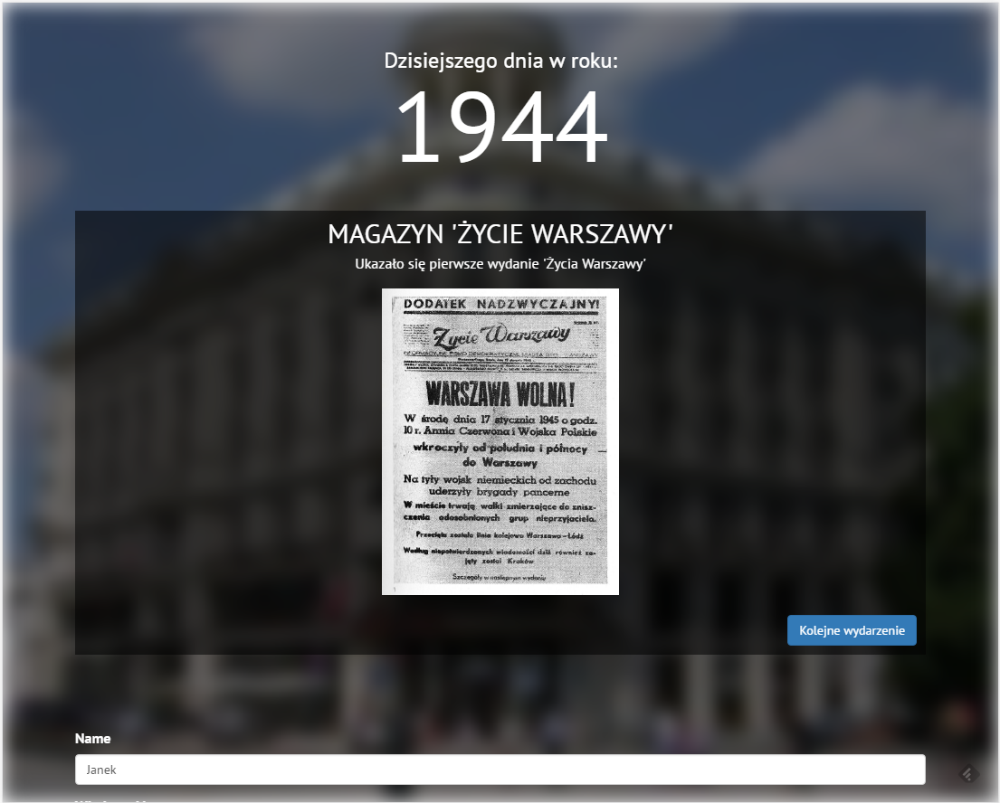

# Hackaton WawCode 2017 - Kalendarz Historyczny Warszawy
## Team Bułka Software


### Screeny z aplikacji i opis (ze slajdów)




## Instalacja

Aby zainstalowac, to trzeba pobrać kod z trzech repozytoriów

- Tutaj linki do repozytoriów

1) Instrukcja do odpalenia backendu (api)
2) instrukcja do odpalenia frontendu
3) Instrukcja do odpalenia crawlera


```

git clone https://github.com/ZielonyBuszmen/WawCodeApi.git

composer install

php bin/console doctrine:database:create

php bin/console doctrine:schema:update --force
 
php bin/console doctrine:fixtures:load -q

php bin/console server:run

 

```
Strona defaultowo dostępna jest pod **http://127.0.0.1:8000**


## Routy

```

/month/{month}
/month-day/{month}/{day}
/today
/random
/create     -> POST

```

