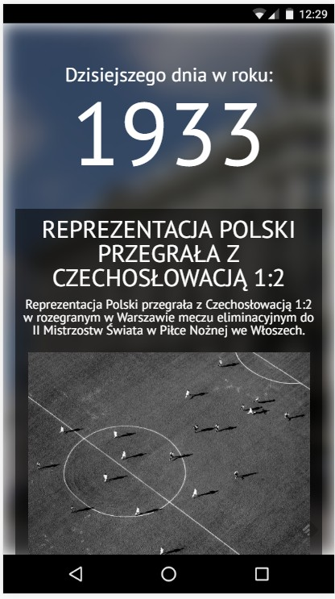
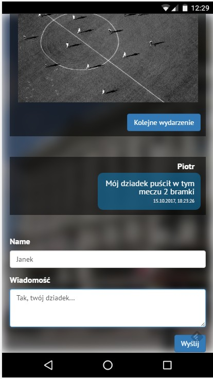
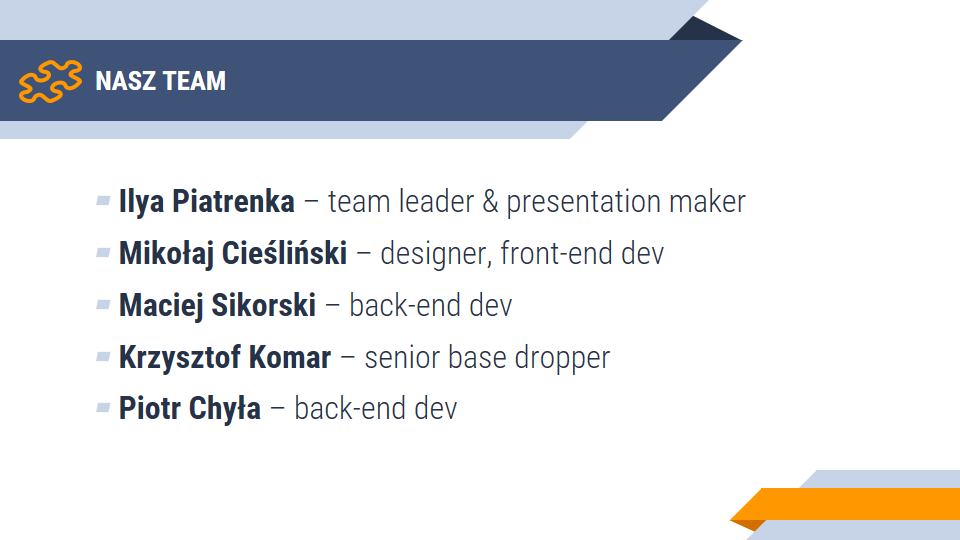
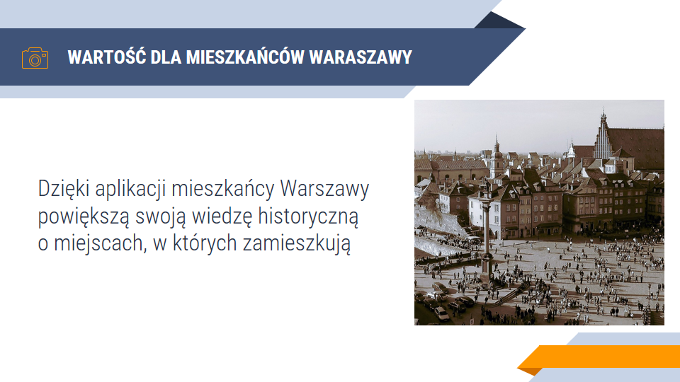
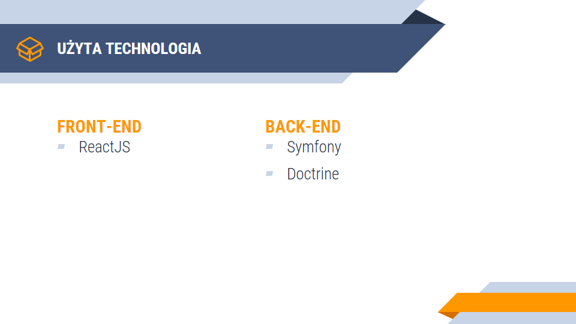
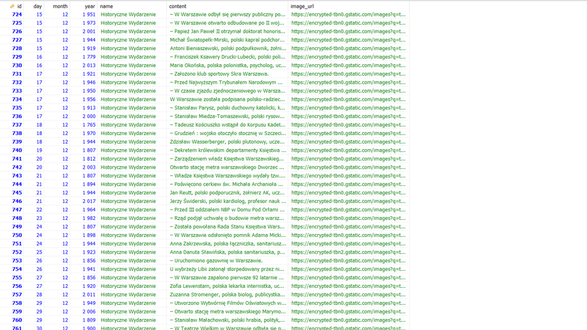
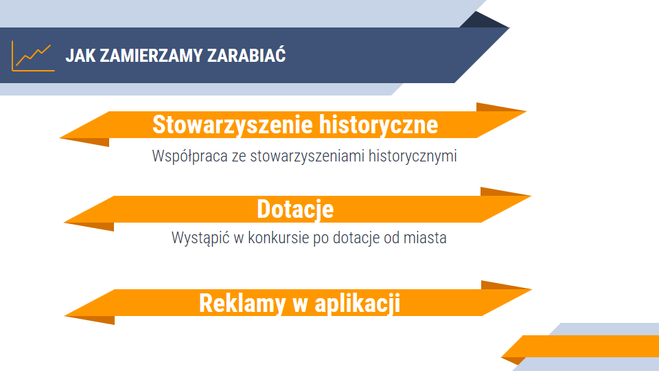
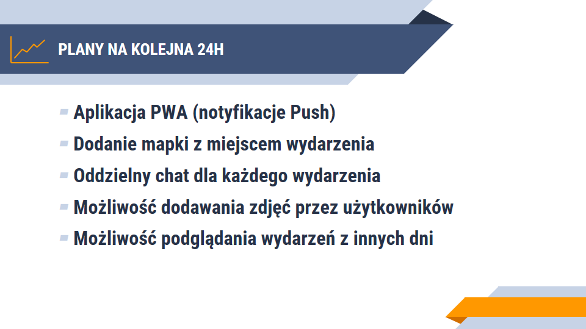

# Hackaton WawCode 2017 - Kalendarz Historyczny Warszawy
## Team Bułka Software


Celem projektu było napisanie "kalendarza historycznego" podczas [hackatonu WawCode](http://www.wawcode.pl/). Kalendarz miał za zadanie wyświetlać wydarzenie z historii Warszawy, które odbyło się tego dnia np. 50 albo 200 lat temu
 
<div align="center">



</div>

Aplikacja umożliwiałaby dodawanie zdjęć oraz komentarzy przez użytkowników, którzy mogliby rozszerzeyć suchą 'wikipedyczną' wiedzę o dodatkowe materiały

Zadanie było tym trudniejsze, iż czas na napisanie apki był ograniczony - tylko 20 godzin podczas weekendowego hackatonu.

Aplikacja została napisana w PHP (Symfony, Doctrine) oraz ReactJS.

<div align="center">




</div>

## Instalacja
Kod projektu został rozdzielony na 3 repozytoria:
- Frontend w ReactJS - [github.com/**odisei369/wawcode-pwa**](https://github.com/odisei369/wawcode-pwa)
- Backend API w Symfony i Doctrine - [github.com/**ZielonyBuszmen/WawCodeApi**](https://github.com/ZielonyBuszmen/WawCodeApi)
- Crawler zbierający dane o wydarzeniach w Symfony - [github.com/**Sikora00/WawCodeCrawler**](https://github.com/Sikora00/WawCodeCrawler)

Instalacja jest podzielona na 3 etapy, musimy postawić środowisko do API, do crawlera oraz do ReactJS. Mimo wszystko nie wymaga to dużych nakładów czasowych, a nasz piękny kod powinien szybko się uruchomić

### 1. Uruchomienie API
Wystarczy sklonować repozytorium, oraz wykonać poniższe instrukcje.
Do działania wymagana jest działająca **baza danych MySQ** oraz zainstalowany w systemie **PHP w wersji 7.1** (lub wyższej).
```
git clone https://github.com/ZielonyBuszmen/WawCodeApi.git

composer install

php bin/console doctrine:database:create
php bin/console doctrine:schema:update --force
php bin/console doctrine:fixtures:load -q

php bin/console server:run
 
```
API domyślnie będzie pod aresem **http://127.0.0.1:8000**


### 2. Wypełnienie danych Crawlerem
// todo


### 3. Postawienie Frontendu w ReactJS
// todo


## Dodatkowe info

### Lista routów do API
```
/month/{month}             -> GET - wybiera wydarzenia z danego miesiąca
/month-day/{month}/{day}   -> GET - wybiera wydarzenia z danego miesiąca i dnia
/today                     -> GET - wydarzenia z dzisiaj
/random                    -> GET - losowe wydarzenie z dzisiejszego dnia
/create                    -> POST - zapisuje wydarzenie w bazce
```


## Prezentacja (zrzut slajdów)

















